# Provider Architecture

This document provides an architectural overview of the terraform-provider-graylog, including component structure, data flow, and design patterns.

## Table of Contents

- [High-Level Architecture](#high-level-architecture)
- [Component Structure](#component-structure)
- [Data Flow](#data-flow)
- [Graylog 7.0 Compatibility Layer](#graylog-70-compatibility-layer)
- [Resource Lifecycle](#resource-lifecycle)
- [Testing Strategy](#testing-strategy)

## High-Level Architecture

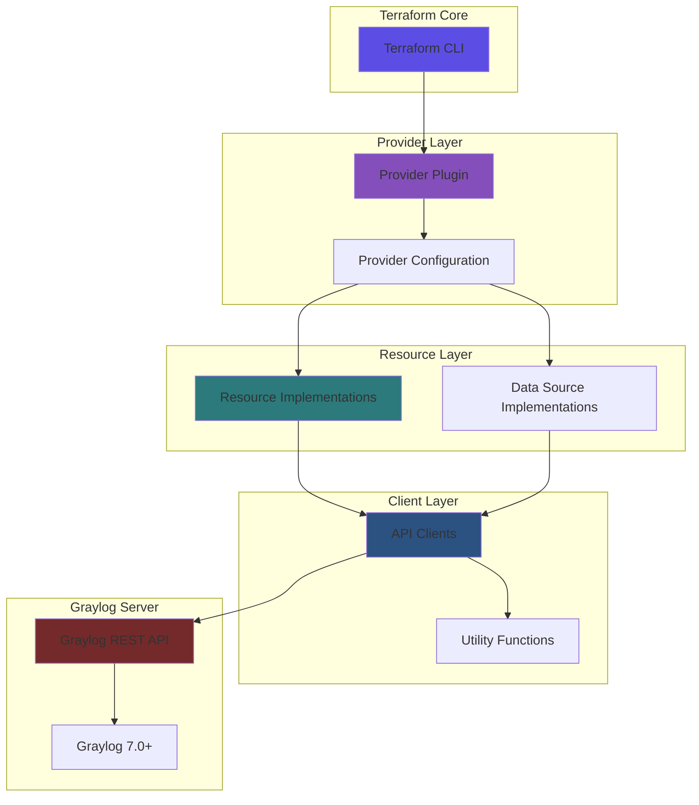
```mermaid
graph TB
    subgraph "Terraform Core"
        TF[Terraform CLI]
    end

    subgraph "Provider Layer"
        PROV[Provider Plugin]
        CONFIG[Provider Configuration]
    end

    subgraph "Resource Layer"
        RES[Resource Implementations]
        DS[Data Source Implementations]
    end

    subgraph "Client Layer"
        CLIENT[API Clients]
        UTIL[Utility Functions]
    end

    subgraph "Graylog Server"
        API[Graylog REST API]
        GL[Graylog 7.0+]
    end

    TF --> PROV
    PROV --> CONFIG
    CONFIG --> RES
    CONFIG --> DS
    RES --> CLIENT
    DS --> CLIENT
    CLIENT --> UTIL
    CLIENT --> API
    API --> GL

    style TF fill:#5C4EE5
    style PROV fill:#844FBA
    style RES fill:#2C7A7B
    style CLIENT fill:#2C5282
    style API fill:#742A2A
```

## Component Structure

### Directory Organization

```
terraform-provider-graylog/
├── cmd/
│   └── terraform-provider-graylog/     # Main entry point
│       └── main.go
├── graylog/
│   ├── provider.go                      # Provider configuration
│   ├── config/
│   │   └── config.go                    # Client configuration
│   ├── resource/                        # Resource implementations
│   │   ├── stream/
│   │   │   ├── resource.go             # Stream resource definition
│   │   │   ├── create.go               # Create operation
│   │   │   ├── read.go                 # Read operation
│   │   │   ├── update.go               # Update operation
│   │   │   └── delete.go               # Delete operation
│   │   ├── input/
│   │   ├── pipeline/
│   │   └── ...                         # Other resources
│   ├── datasource/                      # Data source implementations
│   │   ├── stream/
│   │   ├── index_set/
│   │   └── ...
│   ├── client/                          # API client layer
│   │   ├── stream/
│   │   │   └── client.go               # Stream API client
│   │   ├── input/
│   │   └── ...
│   └── util/
│       └── util.go                      # Shared utilities
├── docs/                                # Provider documentation
└── examples/                            # Testing examples
    ├── graylog7-e2e/                   # Current Graylog 7 testing
    └── v0.12/                          # Legacy reference
```

### Component Responsibilities

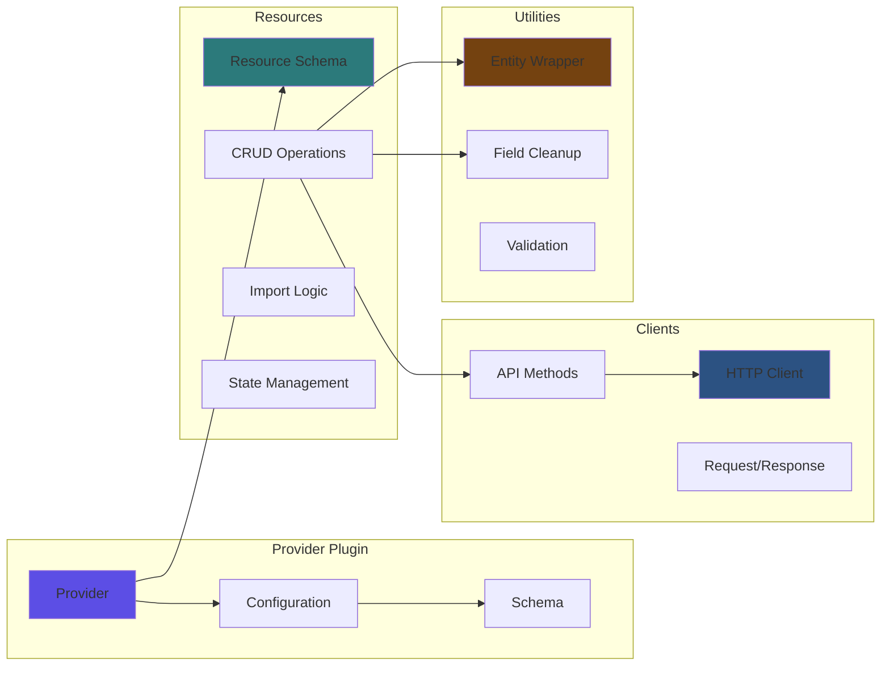
```mermaid
graph LR
    subgraph "Provider Plugin"
        A[Provider] --> B[Configuration]
        B --> C[Schema]
    end

    subgraph "Resources"
        D[Resource Schema]
        E[CRUD Operations]
        F[Import Logic]
        G[State Management]
    end

    subgraph "Clients"
        H[HTTP Client]
        I[API Methods]
        J[Request/Response]
    end

    subgraph "Utilities"
        K[Entity Wrapper]
        L[Field Cleanup]
        M[Validation]
    end

    A --> D
    E --> I
    I --> H
    E --> K
    E --> L

    style A fill:#5C4EE5
    style D fill:#2C7A7B
    style H fill:#2C5282
    style K fill:#744210
```

## Data Flow

### Resource Creation Flow

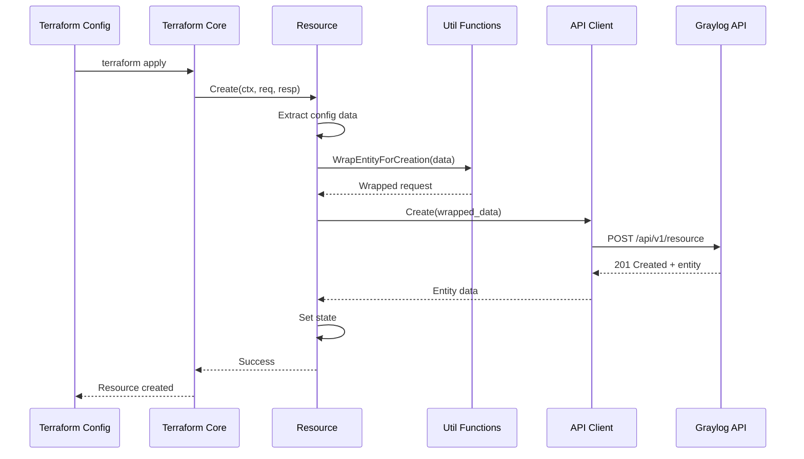
```mermaid
sequenceDiagram
    participant User as Terraform Config
    participant TF as Terraform Core
    participant Res as Resource
    participant Util as Util Functions
    participant Client as API Client
    participant API as Graylog API

    User->>TF: terraform apply
    TF->>Res: Create(ctx, req, resp)
    Res->>Res: Extract config data
    Res->>Util: WrapEntityForCreation(data)
    Util-->>Res: Wrapped request
    Res->>Client: Create(wrapped_data)
    Client->>API: POST /api/v1/resource
    API-->>Client: 201 Created + entity
    Client-->>Res: Entity data
    Res->>Res: Set state
    Res-->>TF: Success
    TF-->>User: Resource created
```

### Resource Update Flow

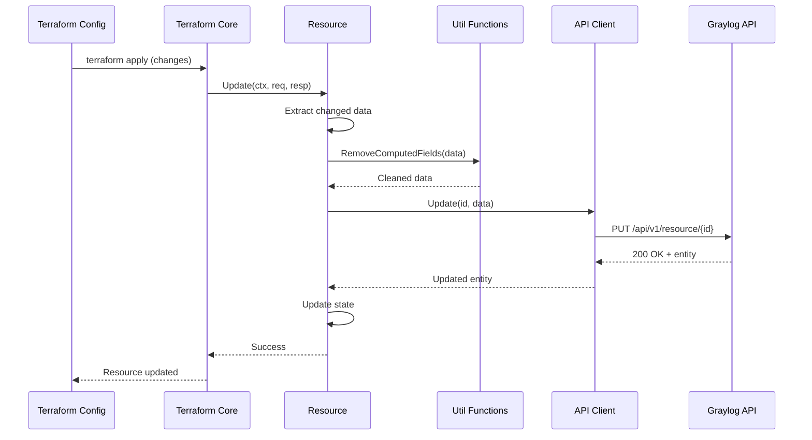
```mermaid
sequenceDiagram
    participant User as Terraform Config
    participant TF as Terraform Core
    participant Res as Resource
    participant Util as Util Functions
    participant Client as API Client
    participant API as Graylog API

    User->>TF: terraform apply (changes)
    TF->>Res: Update(ctx, req, resp)
    Res->>Res: Extract changed data
    Res->>Util: RemoveComputedFields(data)
    Util-->>Res: Cleaned data
    Res->>Client: Update(id, data)
    Client->>API: PUT /api/v1/resource/{id}
    API-->>Client: 200 OK + entity
    Client-->>Res: Updated entity
    Res->>Res: Update state
    Res-->>TF: Success
    TF-->>User: Resource updated
```

### Import Flow

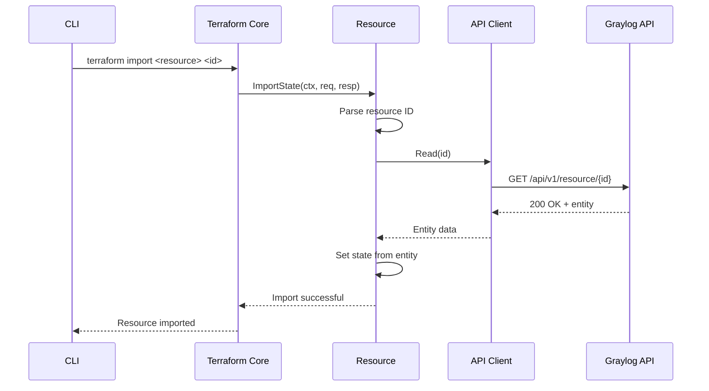
```mermaid
sequenceDiagram
    participant User as CLI
    participant TF as Terraform Core
    participant Res as Resource
    participant Client as API Client
    participant API as Graylog API

    User->>TF: terraform import <resource> <id>
    TF->>Res: ImportState(ctx, req, resp)
    Res->>Res: Parse resource ID
    Res->>Client: Read(id)
    Client->>API: GET /api/v1/resource/{id}
    API-->>Client: 200 OK + entity
    Client-->>Res: Entity data
    Res->>Res: Set state from entity
    Res-->>TF: Import successful
    TF-->>User: Resource imported
```

## Graylog 7.0 Compatibility Layer

### Entity Creation Wrapper

Graylog 7.0 requires entity creation requests to be wrapped in a `CreateEntityRequest` structure:

```mermaid
graph LR
    A[Original Entity] --> B[WrapEntityForCreation]
    B --> C[CreateEntityRequest]

    subgraph "Original Entity"
        A1[title: 'Stream']
        A2[description: 'My stream']
        A3[index_set_id: 'abc']
    end

    subgraph "Wrapped Request"
        C1[entity: {...}]
        C2[share_request: {...}]
    end

    A --> A1
    A --> A2
    A --> A3
    C --> C1
    C --> C2

    style B fill:#744210
    style C fill:#2C7A7B
```

### Computed Field Removal

Graylog 7.0 rejects update requests with read-only fields:

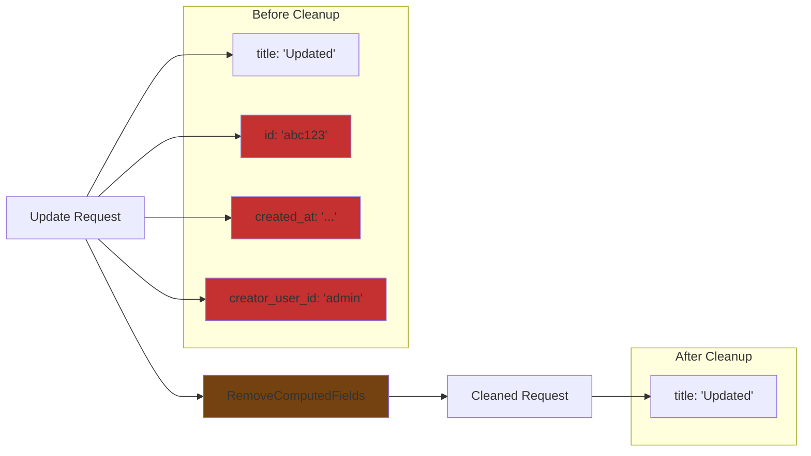
```mermaid
graph LR
    A[Update Request] --> B[RemoveComputedFields]
    B --> C[Cleaned Request]

    subgraph "Before Cleanup"
        A1[title: 'Updated']
        A2[id: 'abc123']
        A3[created_at: '...']
        A4[creator_user_id: 'admin']
    end

    subgraph "After Cleanup"
        C1[title: 'Updated']
    end

    A --> A1
    A --> A2
    A --> A3
    A --> A4
    C --> C1

    style B fill:#744210
    style A2 fill:#C53030
    style A3 fill:#C53030
    style A4 fill:#C53030
```

## Resource Lifecycle

### Complete CRUD Lifecycle

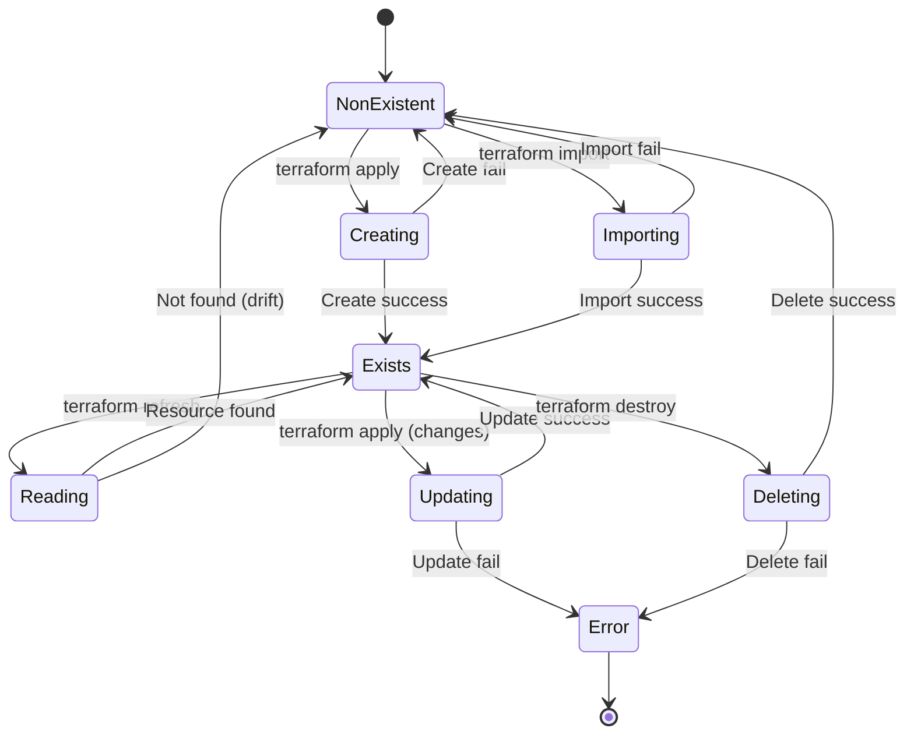
```mermaid
stateDiagram-v2
    [*] --> NonExistent

    NonExistent --> Creating : terraform apply
    Creating --> Exists : Create success
    Creating --> NonExistent : Create fail

    Exists --> Reading : terraform refresh
    Reading --> Exists : Resource found
    Reading --> NonExistent : Not found (drift)

    Exists --> Updating : terraform apply (changes)
    Updating --> Exists : Update success
    Updating --> Error : Update fail

    Exists --> Deleting : terraform destroy
    Deleting --> NonExistent : Delete success
    Deleting --> Error : Delete fail

    NonExistent --> Importing : terraform import
    Importing --> Exists : Import success
    Importing --> NonExistent : Import fail

    Error --> [*]
```

### Resource State Machine

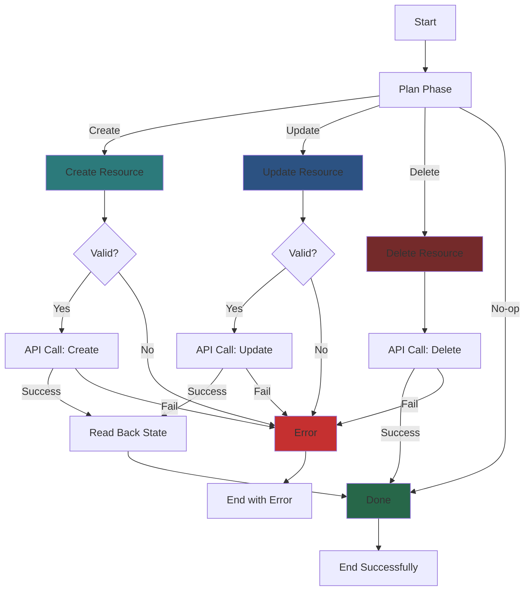
```mermaid
graph TB
    START[Start] --> PLAN[Plan Phase]
    PLAN --> |Create| CREATE[Create Resource]
    PLAN --> |Update| UPDATE[Update Resource]
    PLAN --> |Delete| DELETE[Delete Resource]
    PLAN --> |No-op| DONE[Done]

    CREATE --> VALIDATE_CREATE{Valid?}
    VALIDATE_CREATE --> |Yes| API_CREATE[API Call: Create]
    VALIDATE_CREATE --> |No| ERROR[Error]

    UPDATE --> VALIDATE_UPDATE{Valid?}
    VALIDATE_UPDATE --> |Yes| API_UPDATE[API Call: Update]
    VALIDATE_UPDATE --> |No| ERROR

    DELETE --> API_DELETE[API Call: Delete]

    API_CREATE --> |Success| READ_BACK[Read Back State]
    API_CREATE --> |Fail| ERROR

    API_UPDATE --> |Success| READ_BACK
    API_UPDATE --> |Fail| ERROR

    API_DELETE --> |Success| DONE
    API_DELETE --> |Fail| ERROR

    READ_BACK --> DONE
    ERROR --> END[End with Error]
    DONE --> END_SUCCESS[End Successfully]

    style CREATE fill:#2C7A7B
    style UPDATE fill:#2C5282
    style DELETE fill:#742A2A
    style ERROR fill:#C53030
    style DONE fill:#276749
```

## Testing Strategy

### Local Testing Architecture

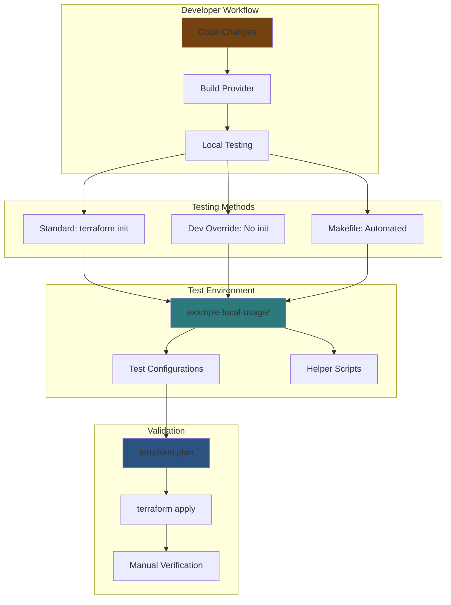
```mermaid
graph TB
    subgraph "Developer Workflow"
        A[Code Changes]
        B[Build Provider]
        C[Local Testing]
    end

    subgraph "Testing Methods"
        D[Standard: terraform init]
        E[Dev Override: No init]
        F[Makefile: Automated]
    end

    subgraph "Test Environment"
        G[example-local-usage/]
        H[Test Configurations]
        I[Helper Scripts]
    end

    subgraph "Validation"
        J[terraform plan]
        K[terraform apply]
        L[Manual Verification]
    end

    A --> B
    B --> C
    C --> D
    C --> E
    C --> F
    D --> G
    E --> G
    F --> G
    G --> H
    G --> I
    H --> J
    J --> K
    K --> L

    style A fill:#744210
    style G fill:#2C7A7B
    style J fill:#2C5282
```

### Testing Pyramid

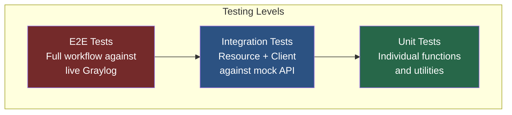
```mermaid
graph TB
    subgraph "Testing Levels"
        A[E2E Tests<br/>Full workflow against<br/>live Graylog]
        B[Integration Tests<br/>Resource + Client<br/>against mock API]
        C[Unit Tests<br/>Individual functions<br/>and utilities]
    end

    A --> B
    B --> C

    style A fill:#742A2A,color:#fff
    style B fill:#2C5282,color:#fff
    style C fill:#276749,color:#fff
```

## Design Patterns

### Client Pattern

Each Graylog API resource has a dedicated client:

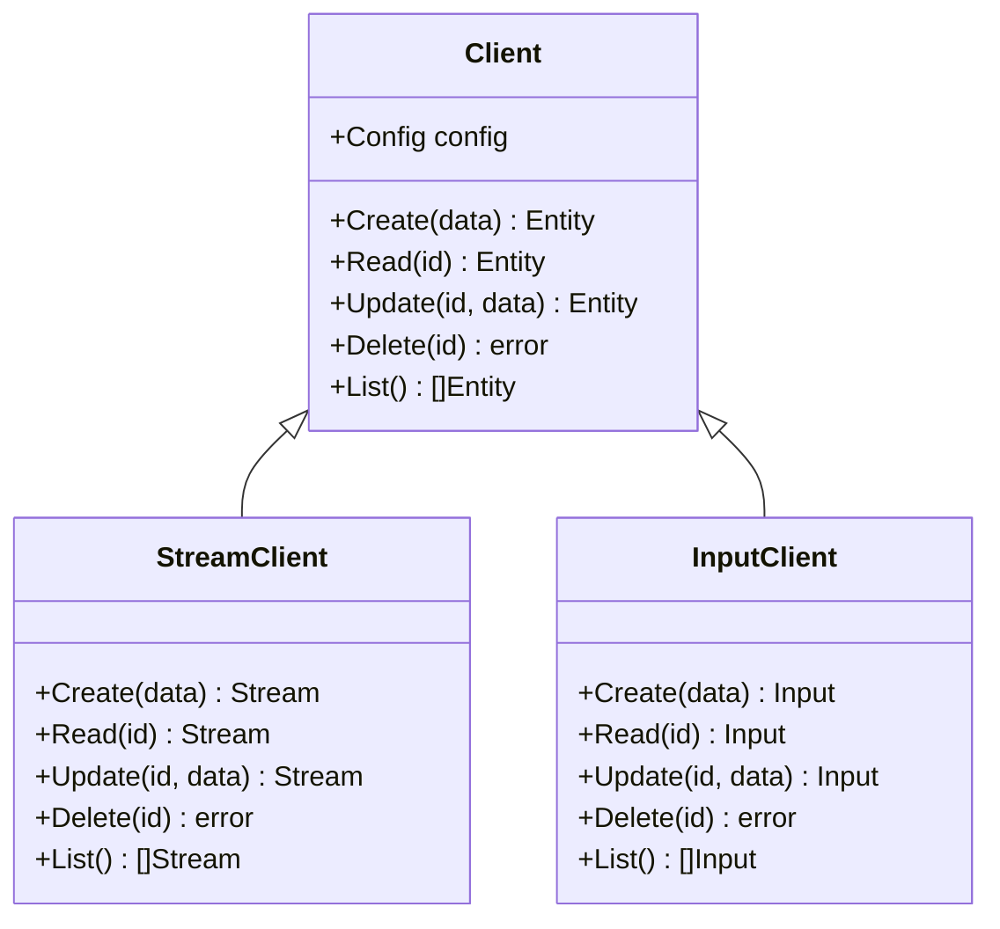
```mermaid
classDiagram
    class Client {
        +Config config
        +Create(data) Entity
        +Read(id) Entity
        +Update(id, data) Entity
        +Delete(id) error
        +List() []Entity
    }

    class StreamClient {
        +Create(data) Stream
        +Read(id) Stream
        +Update(id, data) Stream
        +Delete(id) error
        +List() []Stream
    }

    class InputClient {
        +Create(data) Input
        +Read(id) Input
        +Update(id, data) Input
        +Delete(id) error
        +List() []Input
    }

    Client <|-- StreamClient
    Client <|-- InputClient
```

### Resource Pattern

Each Terraform resource implements the standard CRUD operations:

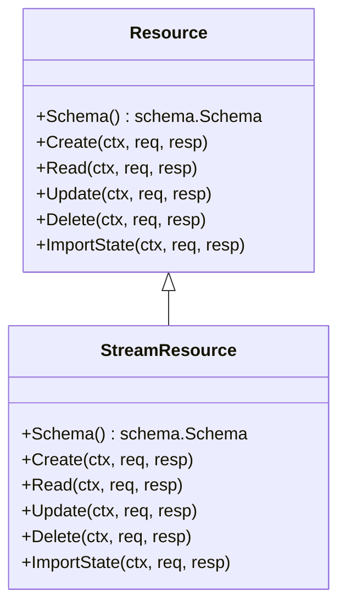
```mermaid
classDiagram
    class Resource {
        +Schema() schema.Schema
        +Create(ctx, req, resp)
        +Read(ctx, req, resp)
        +Update(ctx, req, resp)
        +Delete(ctx, req, resp)
        +ImportState(ctx, req, resp)
    }

    class StreamResource {
        +Schema() schema.Schema
        +Create(ctx, req, resp)
        +Read(ctx, req, resp)
        +Update(ctx, req, resp)
        +Delete(ctx, req, resp)
        +ImportState(ctx, req, resp)
    }

    Resource <|-- StreamResource
```

## Error Handling

### Error Flow

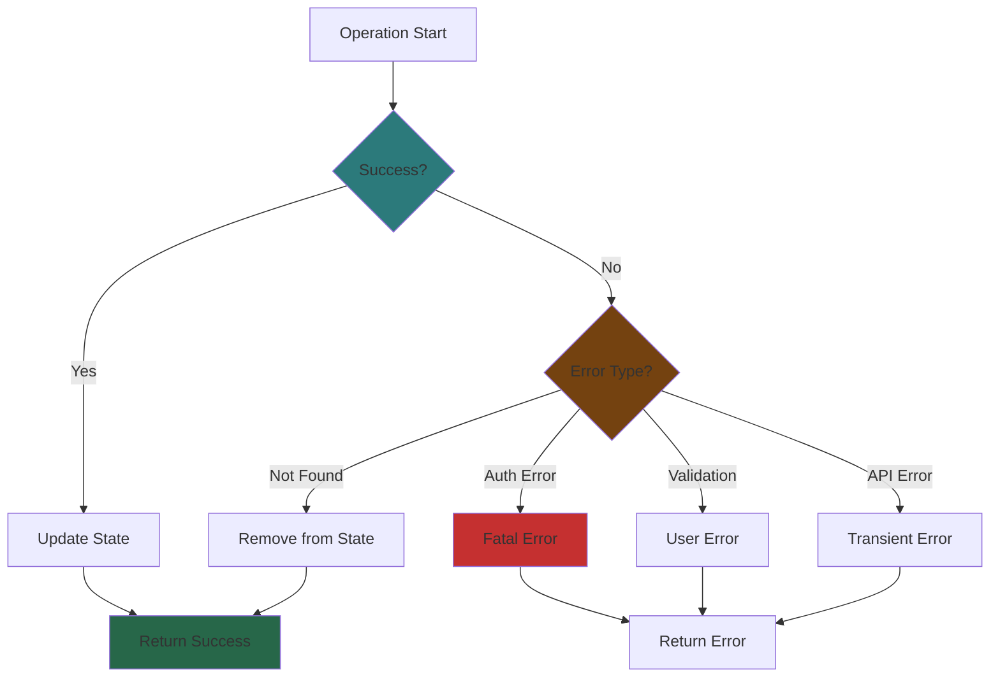
```mermaid
graph TB
    A[Operation Start] --> B{Success?}
    B -->|Yes| C[Update State]
    B -->|No| D{Error Type?}

    D -->|Not Found| E[Remove from State]
    D -->|Auth Error| F[Fatal Error]
    D -->|Validation| G[User Error]
    D -->|API Error| H[Transient Error]

    C --> I[Return Success]
    E --> I
    F --> J[Return Error]
    G --> J
    H --> J

    style B fill:#2C7A7B
    style D fill:#744210
    style F fill:#C53030
    style I fill:#276749
```

## Performance Considerations

### Caching Strategy

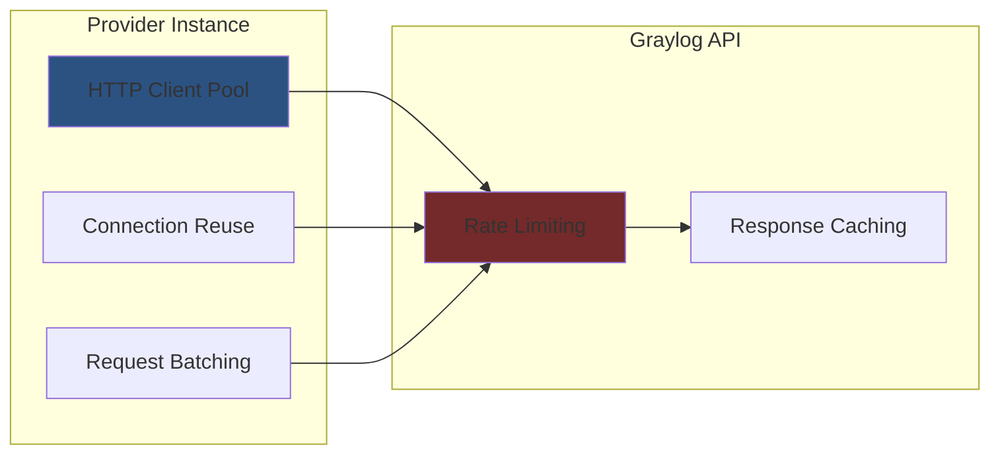
```mermaid
graph LR
    subgraph "Provider Instance"
        A[HTTP Client Pool]
        B[Connection Reuse]
        C[Request Batching]
    end

    subgraph "Graylog API"
        D[Rate Limiting]
        E[Response Caching]
    end

    A --> D
    B --> D
    C --> D
    D --> E

    style A fill:#2C5282
    style D fill:#742A2A
```

## Security

### Authentication Flow

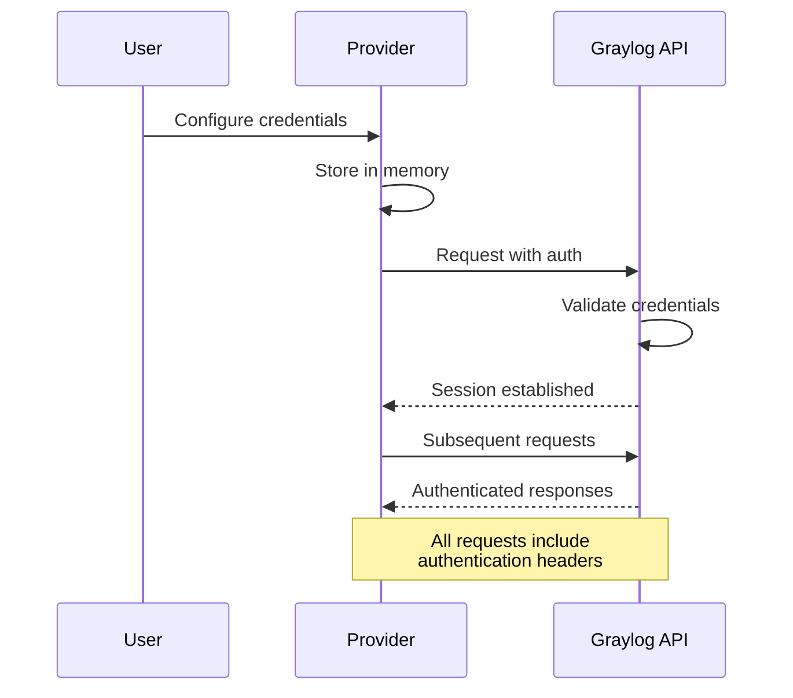
```mermaid
sequenceDiagram
    participant User
    participant Provider
    participant API as Graylog API

    User->>Provider: Configure credentials
    Provider->>Provider: Store in memory
    Provider->>API: Request with auth
    API->>API: Validate credentials
    API-->>Provider: Session established
    Provider->>API: Subsequent requests
    API-->>Provider: Authenticated responses

    Note over Provider,API: All requests include<br/>authentication headers
```

### Credential Precedence

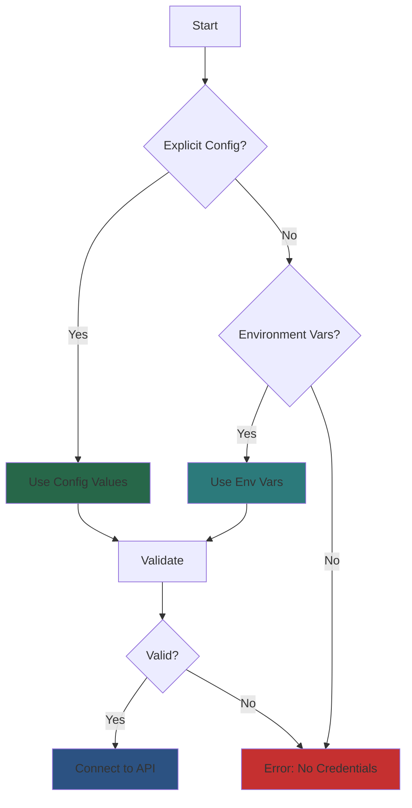
```mermaid
graph TB
    A[Start] --> B{Explicit Config?}
    B -->|Yes| C[Use Config Values]
    B -->|No| D{Environment Vars?}
    D -->|Yes| E[Use Env Vars]
    D -->|No| F[Error: No Credentials]

    C --> G[Validate]
    E --> G
    G --> H{Valid?}
    H -->|Yes| I[Connect to API]
    H -->|No| F

    style C fill:#276749
    style E fill:#2C7A7B
    style F fill:#C53030
    style I fill:#2C5282
```

## Summary

The terraform-provider-graylog architecture is designed with:

- **Clean Separation** - Clear boundaries between provider, resources, and clients
- **Graylog 7.0 Compatibility** - Transparent handling of API changes
- **Extensibility** - Easy to add new resources following established patterns
- **Testability** - Multiple testing methods for different scenarios
- **Error Resilience** - Comprehensive error handling and recovery

For more details on specific components, see:
- [API Mapping](api_mapping.md) - API endpoint documentation
- [Local Testing Guide](../guides/local_usage.md) - Development workflow